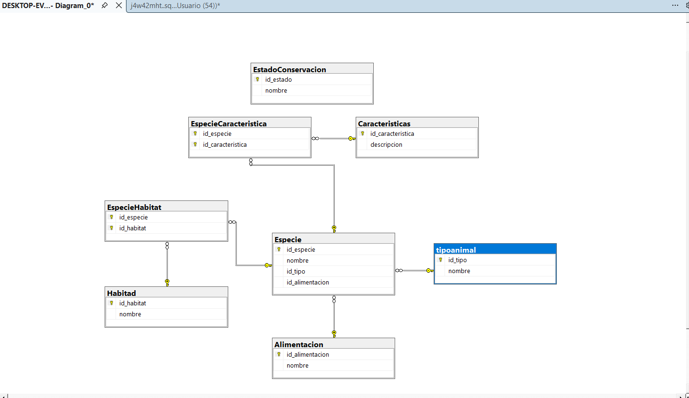

# My Application README


# Proyecto Integrador B1 - 2026

## Sistema de Avistamiento de Animales

### Descripción del proyecto

Este proyecto tiene como objetivo desarrollar una aplicación para gestionar información relacionada con el avistamiento de animales, permitiendo organizar datos sobre especies, tipos de animales, hábitats, características, alimentación y estados de conservación.

El proyecto se desarrolla como parte del Proyecto Integrador del grupo B1 - 2026, aplicando los conocimientos adquiridos en desarrollo de software y bases de datos.

## Modelo Entidad-Relación (MER)

El siguiente diagrama representa la estructura de la base de datos, sus entidades y las relaciones establecidas entre ellas.



## Tecnologías utilizadas

- Java
- Vaadin
- Maven
- SQL Server

## Requisitos previos

- Java JDK compatible con la versión configurada en el proyecto.
- Maven o el ejecutable Maven Wrapper incluido en el repositorio.
- Un entorno de desarrollo compatible con Java.
- SQL Server para la gestión de la base de datos.

## Instalación y ejecución

### 1. Clonar el repositorio

```bash
git clone https://github.com/miguelchica31/Proyecto-Integrador-b1-2026-g5.git
```

### 2. Ingresar a la carpeta del proyecto

```bash
cd Proyecto-Integrador-b1-2026-g5
```

### 3. Ejecutar la aplicación

En Windows:

```bash
mvnw.cmd
```

En Linux o macOS:

```bash
./mvnw
```

También puedes importar el proyecto en tu IDE y ejecutar la clase `Application`.

### 4. Acceder a la aplicación

Si la aplicación inicia correctamente en el puerto predeterminado, abre la siguiente dirección en tu navegador:

http://localhost:8080

## Estructura de la base de datos

La base de datos contempla las siguientes entidades y tablas:

- **tipoanimal:** almacena los tipos de animales.
- **Especie:** registra las especies y su tipo de alimentación.
- **Alimentacion:** almacena los tipos de alimentación.
- **Habitad:** registra los hábitats.
- **Caracteristicas:** almacena las características de las especies.
- **EstadoConservacion:** registra los estados de conservación.
- **EspecieHabitat:** relaciona las especies con sus hábitats.
- **EspecieCaracteristica:** relaciona las especies con sus características.

## Integrantes

- Miguel Angel Chica Londoño
- Deiliber David Acosta Urrego.

## Estado del proyecto

Proyecto académico en desarrollo.
